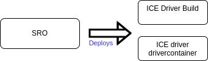
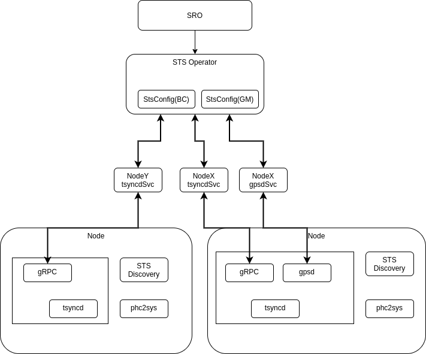
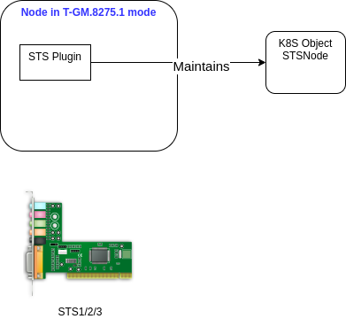
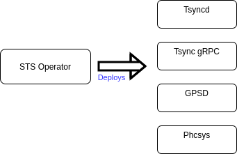

# Silicom STS Special Resource Usage


# Silicom STS Operator


# Silicom STS Plugin daemonsets


# Silicom STS Operator deployments


## Table of Contents
- [STS Operator](#sts-operator)
- [STS Plugin](#sts-plugin)
- [StsConfig](#stsconfig)
- [Quick Start](#quick-start)

## Links
- [Is your app air gap friendly?](https://cloud.redhat.com/blog/is-your-operator-air-gap-friendly)
- [Building air gap friendly](https://cloud.redhat.com/blog/building-an-air-gap-friendly-operator)
- [Operators in restricted networks](https://docs.openshift.com/container-platform/4.9/operators/operator_sdk/osdk-generating-csvs.html#olm-enabling-operator-for-restricted-network_osdk-generating-csvs)

## STS Operator
Sts Operator, runs in `sts-silicom` namespace, manages cluster wide STS configurations. It offers `StsConfig` and `StsOperatorConfig` CRDs and creates `tsyncd` to apply node specific STS config.

## STS Plugin daemonset (feature.node.kubernetes.io/custom-silicom.sts.devices: "true")
Once NFD operator has labelled the nodes, this daemonset queries the network interfaces and STS specific information and accordingly labels the nodes.

## STS daemonset (sts.silicom.com/config: "gm-1")
This consists of the following daemons on labelled nodes, all of these running in the same pod. Nodes labelled with the
* tsyncd
* GPSd (if in T-GM.8275.1 mode)
* ts2phcs
* phc2sys
* grpc-tsyncd

## StsOperatorConfig
Example (default)
```yaml
apiVersion: sts.silicom.com/v1alpha1
kind: StsOperatorConfig
metadata:
  name: stsoperatorconfig
spec:
  images:
  sro:

```

## StsConfig
Example  (Grand Master mode)
```yaml
apiVersion: sts.silicom.com/v1alpha1
kind: StsConfig
metadata:
  name: gm-1
  namespace: sts-silicom
spec:
  namespace: sts-silicom
  nodeSelector:
    sts.silicom.com/config: "gm-1"
  mode: T-GM.8275.1
  interfaces:
    - ethName: enp2s0f0
      synce: 1
      holdoff: 500
      mode: Master
      ethPort: 1
    - ethName: enp2s0f1
      synce: 1
      holdoff: 500
      mode: Master
      ethPort: 2
```

## StsNode
Example
```yaml
apiVersion: sts.silicom.com/v1alpha1
kind: StsNode
metadata:
  name: worker2
  namespace: sts-silicom
spec: {}
status:
  ethInterfaces:
  - ethName: enp2s0f0
    ethPort: 0
    pciAddr: "02:00.0"
    status: down
  - ethName: enp2s0f1
    ethPort: 1
    pciAddr: "02:00.1"
    status: down
  - ethName: enp2s0f2
    ethPort: 2
    pciAddr: "02:00.2"
    status: down
  - ethName: enp2s0f3
    ethPort: 3
    pciAddr: "02:00.3"
    status: down
  - ethName: enp2s0f4
    ethPort: 4
    pciAddr: "02:00.4"
    status: down
  - ethName: enp2s0f5
    ethPort: 5
    pciAddr: "02:00.5"
    status: down
  - ethName: enp2s0f6
    ethPort: 6
    pciAddr: "02:00.6"
    status: down
  - ethName: enp2s0f7
    ethPort: 7
    pciAddr: "02:00.7"
    status: down
  gpsStatus:
    active: 0
    device: ""
    lat: ""
    lon: ""
    mode: 0
    time: "2021-12-07T08:56:41.781Z"

```

```
fb@g9:~$ oc get stsconfig.sts.silicom.com  -n sts-silicom -o yaml
apiVersion: v1
items:
- apiVersion: sts.silicom.com/v1alpha1
  kind: StsConfig
  metadata:
    annotations:
      kubectl.kubernetes.io/last-applied-configuration: |
        {"apiVersion":"sts.silicom.com/v1alpha1","kind":"StsConfig","metadata":{"annotations":{},"name":"gm-1","namespace":"sts-silicom"},"spec":{"interfaces":[{"ethName":"enp2s0f0","holdoff":500,"synce":true},{"ethName":"enp2s0f1","holdoff":500,"synce":true}],"mode":"gm","name":"gm-1","namespace":"sts-silicom","nodeSelector":{"sts.silicom.com/config":"gm-1"}}}
    creationTimestamp: "2021-10-25T13:40:30Z"
    generation: 1
  spec:
    interfaces:
    - ethName: enp2s0f0
      holdoff: 500
      synce: true
      mode: Slave
    - ethName: enp2s0f1
      holdoff: 500
      synce: true
      mode: Master
    mode: T-GM.8275.1
    name: gm-1
    namespace: sts-silicom
    nodeSelector:
      sts.silicom.com/config: "gm-1"
kind: List
metadata:
  resourceVersion: ""
  selfLink: ""

```
